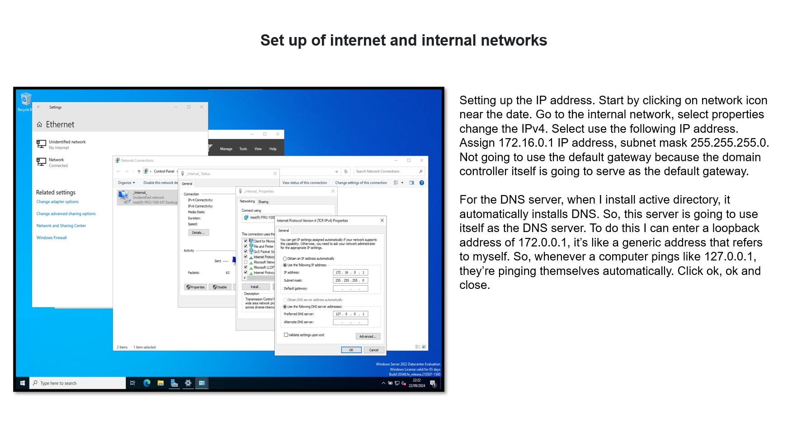
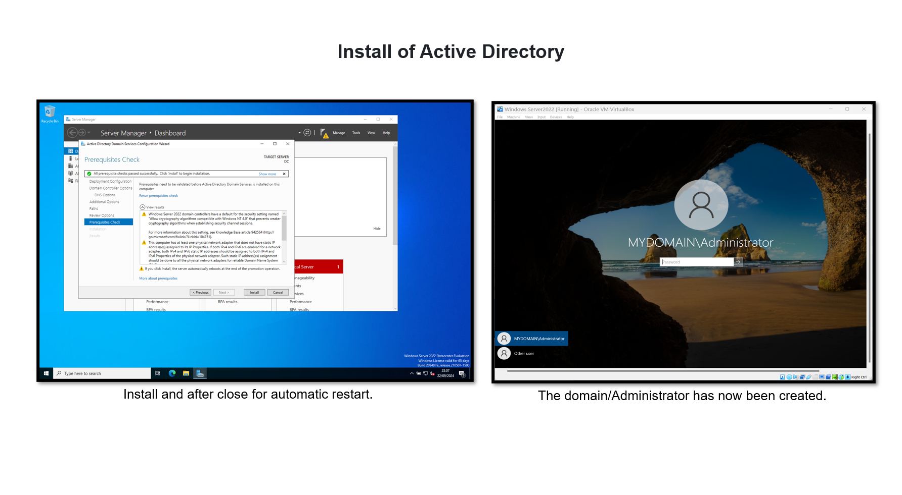
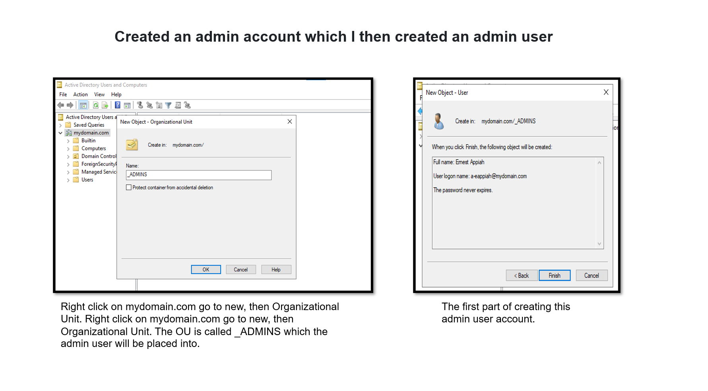
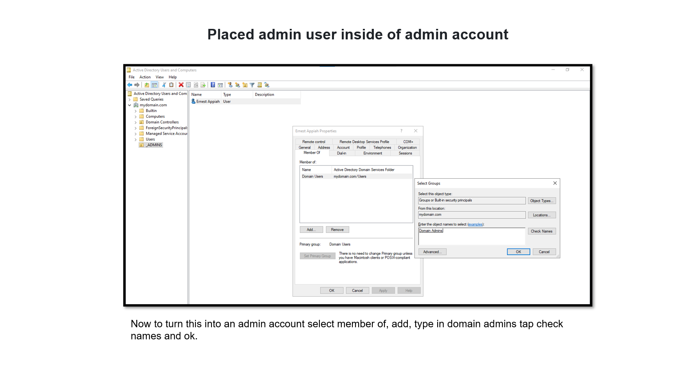
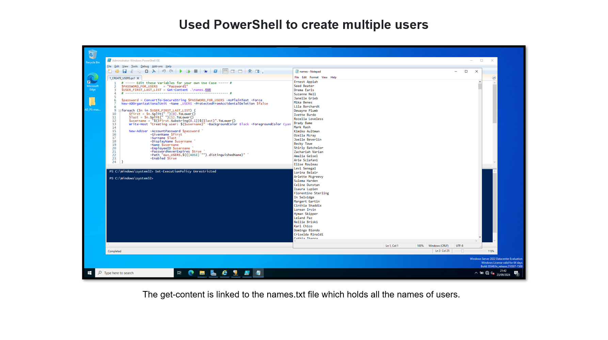
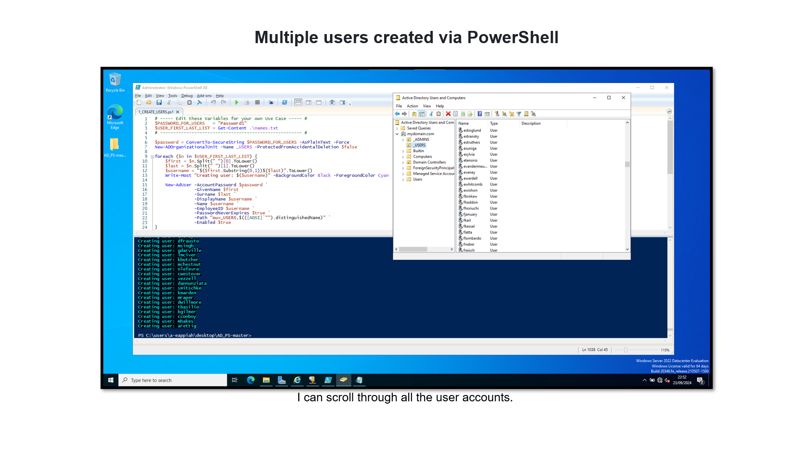
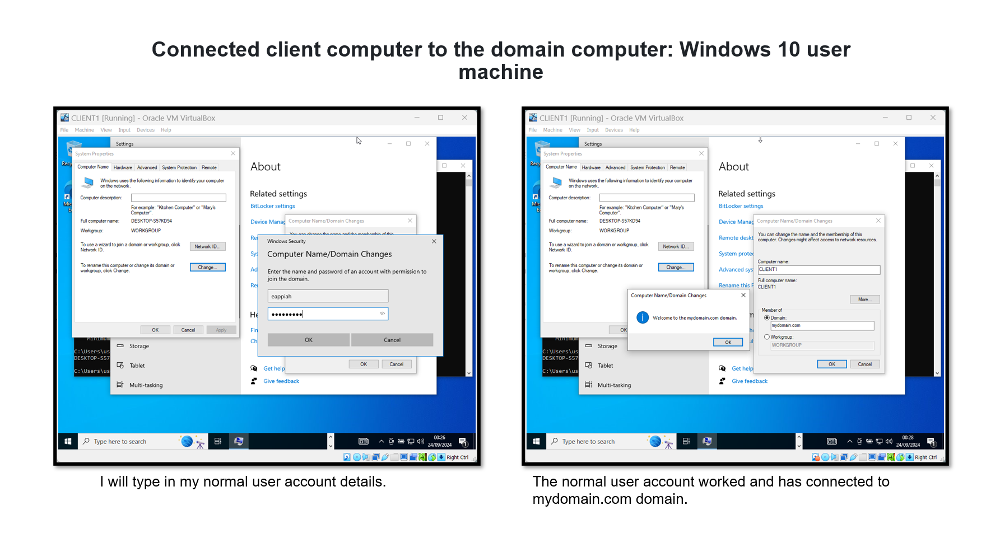

# WindowsServer-2022-Lab
## Windows Server 2022 Lab
 
### Lab:
<li>Set up internet and internet networks. Install of Active Directory
<li>Created an admin account which I then created an admin user that was placed inside of this account
<li>Used PowerShell to create multiple users
<li>EConnected client computer to the domain computer: Windows 10 user machine

### Software used:
Virtual Box: to run Windows Server 2022
Windows 10: Operating System

### Lab pdf:
For the full pdf version of this lab click on the link below, when viewing keep pressing more pages button or if the more pages button disappears press the git hub logo that is loading. 

[Your Link Here](https://github.com/EA-IT2/WindowsServer-2022-Lab/blob/main/Windows%20Server%202022%20Lab.pdf)

